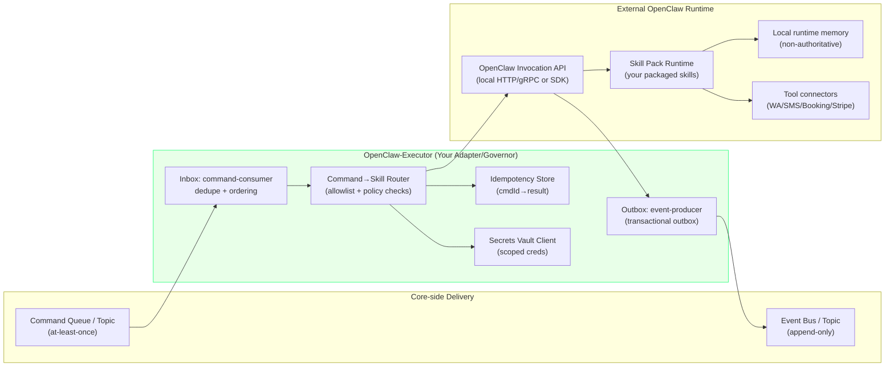
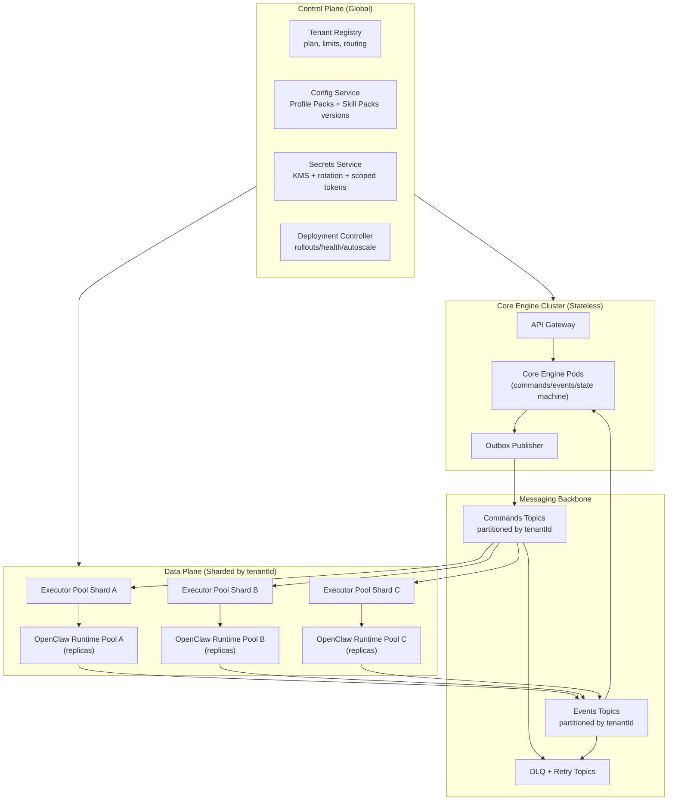

# ARO + OpenClaw Integration Diagrams

Date: 2026-02-22

## 1) End-to-end ARO flow

```mermaid
sequenceDiagram
  autonumber
  actor U as User
  participant UI as Profile Web UI
  participant BFF as Profile Backend (BFF)
  participant CORE as Core Engine (SoR + Orchestrator)
  participant BUS as Command/Event Bus
  participant EX as OpenClaw-Executor (Adapter/Governor)
  participant OCR as External OpenClaw Runtime (Skill Engine)
  participant EXT as External APIs (Booking/SMS/WA/Payments/Reviews)

  U->>UI: Click / configure / view status
  UI->>BFF: REST/GraphQL: "Enable ARO for Clinic X"
  BFF->>CORE: Command: ConfigureProfile + Policies/Templates
  CORE-->>BFF: Ack (command accepted)
  BFF-->>UI: OK + show onboarding steps

  Note over EXT,CORE: External world produces triggers (booking events, message replies, time triggers)

  EXT-->>CORE: Webhook/Event: booking_created(appointmentId)
  CORE->>CORE: Validate + Transition FSM (booked -> pending_confirm)
  CORE->>BUS: Emit Command: SendReminder(appointmentId, templateId)

  BUS-->>EX: Deliver Command (at-least-once)
  EX->>EX: Dedupe/idempotency check
  EX->>OCR: Invoke Skill: messaging.send(template, recipient, vars)
  OCR->>EXT: Call API: WhatsApp/SMS send
  EXT-->>OCR: Result: sent(messageId)
  OCR-->>EX: Skill Result: sent(messageId)
  EX-->>BUS: Emit Event: message_sent(appointmentId, messageId)

  BUS-->>CORE: Event: message_sent
  CORE->>CORE: Update state + append audit log

  EXT-->>CORE: Webhook: inbound_reply(messageId, text)
  CORE->>BUS: Command: ClassifyReply(text) (optional)
  BUS-->>EX: Command: ClassifyReply
  EX->>OCR: Skill: nlp.classify(text)
  OCR-->>EX: Result: intent=confirm|reschedule|cancel|other
  EX-->>BUS: Event: reply_classified(intent)

  BUS-->>CORE: Event: reply_classified
  CORE->>CORE: Apply policy; transition; emit next commands (reschedule_link, etc.)
```

Key point: Core Engine is authoritative. OpenClaw Runtime executes skills via the Executor. OpenClaw never directly runs the business.

## 2) OpenClaw-Executor ↔ External OpenClaw Runtime communication



Recommended contract between Executor and OpenClaw Runtime:
- Invocation is synchronous (request/response) per skill call
- Workflow is asynchronous (Core drives multi-step)
- Executor enforces allowlist, rate limits, idempotency, and credential scoping

## 3) Scaling External OpenClaw to 100k+ users

### 3A) Control plane / data plane architecture



### 3B) Partitioning and sticky routing

- Partition command topics by `tenantId` (consistent hashing)
- Bind partitions to bounded Executor workers
- Route tenant-to-runtime with consistent hashing + healthy fallback

### 3C) Deployment options

- Option 1: Hosted Executors + Hosted OpenClaw Runtime (recommended at 100k+)
- Option 2: Hosted Core + Customer-hosted Executor/OpenClaw (best for strict locality)

### 3D) Runtime scaling and safety

- Keep OpenClaw Runtime as stateless as possible
- Bound per-runtime concurrency
- Split pools by workload type when needed
- Ensure idempotent retries with dedupe keys for non-idempotent providers